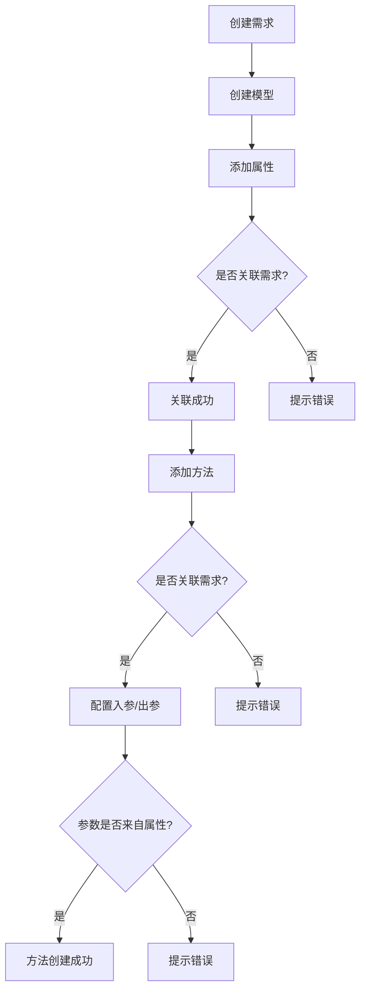
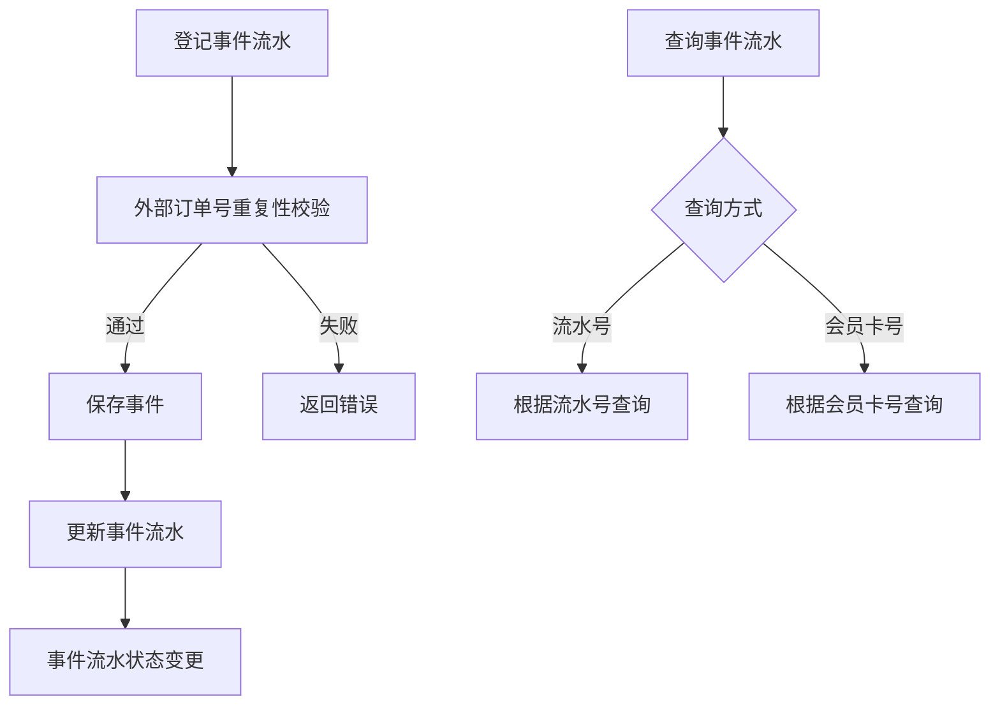

## 1. 产品概述

模型管理系统是一个用于创建和管理业务模型的平台，支持模型的属性、方法和需求三个维度的定义与关联。系统采用需求驱动的设计理念，确保每个属性和方法都能追溯到具体的业务需求。

* **核心价值**：提供标准化的模型设计流程，实现需求、属性、方法的完整关联与追溯

* **目标用户**：系统架构师、业务分析师、开发人员

## 2. 核心功能

### 2.1 用户角色

| 角色   | 注册方式 | 核心权限                        |
| ---- | ---- | --------------------------- |
| 管理员  | 系统配置 | 完整的模型管理权限，包括创建、编辑、删除模型及相关内容 |
| 普通用户 | 账号注册 | 浏览和查询模型信息                   |

### 2.2 功能模块

1. **需求管理**：创建、编辑、删除需求，为模型设计提供业务依据
2. **模型管理**：创建和管理模型，关联需求
3. **属性管理**：为模型添加属性，关联需求
4. **方法管理**：为模型添加方法，关联需求，配置入参和出参
5. **事件模型**：基于事件.md定义的事件模型示例

### 2.3 页面详情

| 页面名称 | 模块名称 | 功能描述               |
| ---- | ---- | ------------------ |
| 首页   | 仪表盘  | 展示模型统计、最近活动、快捷操作入口 |
| 需求管理 | 需求列表 | 需求的CRUD操作，支持搜索和筛选  |
| 需求管理 | 需求表单 | 创建和编辑需求的表单页面       |
| 模型管理 | 模型列表 | 模型的CRUD操作，支持搜索和筛选  |
| 模型管理 | 模型表单 | 创建和编辑模型的表单页面       |
| 模型详情 | 属性管理 | 管理模型的属性，关联需求       |
| 模型详情 | 方法管理 | 管理模型的方法，关联需求，配置参数  |
| 事件模型 | 事件列表 | 事件流水查询功能           |

## 3. 核心流程

### 3.1 模型创建流程

用户首先创建需求 → 基于需求创建模型 → 为模型添加属性（关联需求） → 为模型添加方法（关联需求，从属性中选择参数）

### 3.2 流程图

### 3.3 事件模型流程

## 4. 用户界面设计

### 4.1 设计风格

* **主色调**：深蓝色 (#1e3a5f)，科技感专业配色

* **辅助色**：青色 (#00d4ff)，用于强调和交互元素

* **按钮样式**：圆角矩形，hover时有阴影和缩放效果

* **字体**：Inter，清晰易读的无衬线字体

* **布局风格**：卡片式布局，左侧导航，右侧内容区

* **图标风格**：简洁线条图标

### 4.2 页面设计概览

| 页面名称 | 模块名称 | UI元素                |
| ---- | ---- | ------------------- |
| 首页   | 仪表盘  | 统计卡片、图表、快捷入口        |
| 需求管理 | 需求列表 | 表格、搜索框、操作按钮         |
| 模型管理 | 模型列表 | 卡片列表、筛选器、创建按钮       |
| 模型详情 | 属性管理 | 属性表格、添加按钮、需求关联选择器   |
| 模型详情 | 方法管理 | 方法表格、参数配置弹窗、需求关联选择器 |

### 4.3 响应式设计

* 桌面端：完整布局，左侧导航+右侧内容

* 平板端：紧凑布局，折叠导航

* 移动端：单列布局，底部导航

## 5. 事件模型详细需求

### 5.1 事件属性

| 属性名称      | 描述            |
| --------- | ------------- |
| 外部流水号一级   | 外部系统的一级流水号    |
| 外部流水号二级   | 外部系统的二级流水号    |
| 积分品牌代码    | 积分品牌标识        |
| 场景码       | 业务场景标识        |
| 主订单号      | 系统生成的主订单号     |
| 子订单号      | 系统生成的子订单号     |
| 事件发起时间    | 事件发生时间        |
| 内外部合作伙伴代码 | 积分商行代码        |
| 会员卡号      | 会员标识          |
| 销售渠道一级    | 一级销售渠道        |
| 销售渠道二级    | 二级销售渠道        |
| 入账标识      | 1=手动入账 2=自动入账 |
| 外部流水号三级   | 外部系统的三级流水号    |
| 业务标签      | 业务分类标签        |
| 事件类型      | 事件的具体类型       |
| 事件金额      | 事件涉及金额        |
| PFRID     | 唯一标识          |
| 操作人       | 操作用户          |
| 备注        | 备注信息          |

### 5.2 事件方法

| 方法名称         | 描述          |
| ------------ | ----------- |
| 登记事件流水       | 记录新的事件流水    |
| 更新事件流水       | 更新已有事件流水信息  |
| 事件流水状态变更     | 修改事件流水状态    |
| 外部订单号重复性校验   | 校验外部订单号是否重复 |
| 根据流水号查询事件流水  | 通过流水号查询事件   |
| 事件总额度计算      | 计算事件总金额     |
| 根据会员卡号查询事件流水 | 通过会员卡号查询事件  |
| 原事件流水查询      | 查询原始事件流水    |
| 事件可逆校验       | 校验事件是否可逆    |

### 5.3 需求说明

1. 记录会员积分发生变化的交易事件（如乘机入账、生态产品购买入账、入账撤发、机票兑换、兑换退分等）
2. 包含请求者上送字段和自有生成字段
3. 一次请求可能包含多笔事件类型，但只有一个外部流水号一级，生成一个主订单号

