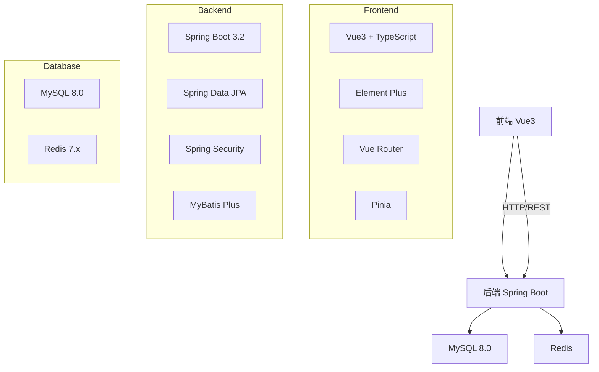
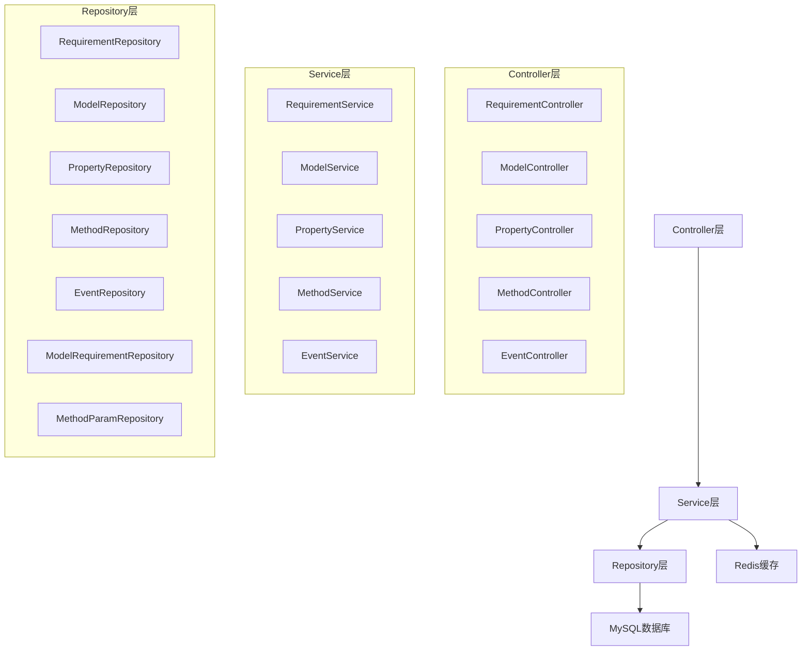
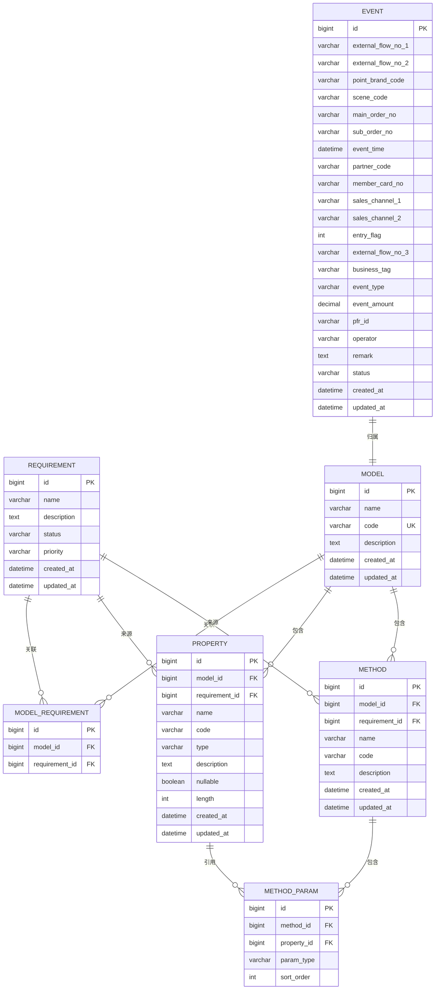

## 1. 架构设计



## 2. 技术说明

### 2.1 前端技术栈
- **框架**: Vue 3.4 + TypeScript
- **UI组件库**: Element Plus 2.5
- **路由**: Vue Router 4.3
- **状态管理**: Pinia 2.1
- **构建工具**: Vite 5.2
- **HTTP客户端**: Axios 1.6

### 2.2 后端技术栈
- **框架**: Spring Boot 3.2.5
- **数据库**: MySQL 8.0.36
- **ORM**: Spring Data JPA + MyBatis Plus 3.5
- **缓存**: Redis 7.2
- **安全**: Spring Security 6.2
- **文档**: SpringDoc OpenAPI 2.3
- **Java版本**: JDK 21

### 2.3 项目结构
- **代码目录**: /Users/zhangquanyu/mProject/z-model/code
- **前端**: code/frontend
- **后端**: code/backend

## 3. 路由定义

### 3.1 前端路由
| 路由路径 | 页面组件 | 功能描述 |
|----------|----------|----------|
| / | Dashboard | 首页仪表盘 |
| /requirements | RequirementList | 需求列表 |
| /requirements/create | RequirementForm | 创建需求 |
| /requirements/:id/edit | RequirementForm | 编辑需求 |
| /models | ModelList | 模型列表 |
| /models/create | ModelForm | 创建模型 |
| /models/:id | ModelDetail | 模型详情 |
| /models/:id/properties | PropertyList | 属性管理 |
| /models/:id/methods | MethodList | 方法管理 |
| /events | EventList | 事件流水查询 |

### 3.2 后端API路由
| API路径 | HTTP方法 | Controller | 功能描述 |
|----------|----------|------------|----------|
| /api/requirements | GET | RequirementController | 查询需求列表 |
| /api/requirements | POST | RequirementController | 创建需求 |
| /api/requirements/{id} | GET | RequirementController | 查询需求详情 |
| /api/requirements/{id} | PUT | RequirementController | 更新需求 |
| /api/requirements/{id} | DELETE | RequirementController | 删除需求 |
| /api/models | GET | ModelController | 查询模型列表 |
| /api/models | POST | ModelController | 创建模型 |
| /api/models/{id} | GET | ModelController | 查询模型详情 |
| /api/models/{id} | PUT | ModelController | 更新模型 |
| /api/models/{id} | DELETE | ModelController | 删除模型 |
| /api/models/{id}/properties | GET | PropertyController | 查询模型属性 |
| /api/models/{id}/properties | POST | PropertyController | 添加属性 |
| /api/models/{id}/properties/{propertyId} | PUT | PropertyController | 更新属性 |
| /api/models/{id}/properties/{propertyId} | DELETE | PropertyController | 删除属性 |
| /api/models/{id}/methods | GET | MethodController | 查询模型方法 |
| /api/models/{id}/methods | POST | MethodController | 添加方法 |
| /api/models/{id}/methods/{methodId} | PUT | MethodController | 更新方法 |
| /api/models/{id}/methods/{methodId} | DELETE | MethodController | 删除方法 |
| /api/events | GET | EventController | 查询事件流水 |
| /api/events | POST | EventController | 登记事件流水 |
| /api/events/{id} | GET | EventController | 查询事件详情 |
| /api/events/{id} | PUT | EventController | 更新事件流水 |
| /api/events/{id}/status | PUT | EventController | 状态变更 |
| /api/events/validate | POST | EventController | 重复性校验 |
| /api/events/total | GET | EventController | 总额度计算 |

## 4. API定义

### 4.1 需求API

**GET /api/requirements**
- 请求参数：page, size, keyword
- 响应：Page<RequirementDTO>

**POST /api/requirements**
- 请求体：
```json
{
    "name": "string",
    "description": "string",
    "status": "DRAFT|PENDING|APPROVED|REJECTED",
    "priority": "LOW|MEDIUM|HIGH"
}
```
- 响应：RequirementDTO

**PUT /api/requirements/{id}**
- 请求体：同上
- 响应：RequirementDTO

### 4.2 模型API

**POST /api/models**
- 请求体：
```json
{
    "name": "string",
    "code": "string",
    "description": "string",
    "requirementIds": ["string"]
}
```
- 响应：ModelDTO

### 4.3 属性API

**POST /api/models/{id}/properties**
- 请求体：
```json
{
    "name": "string",
    "code": "string",
    "type": "STRING|INTEGER|DECIMAL|DATE|BOOLEAN",
    "description": "string",
    "requirementId": "string",
    "nullable": true,
    "length": 255
}
```
- 响应：PropertyDTO

### 4.4 方法API

**POST /api/models/{id}/methods**
- 请求体：
```json
{
    "name": "string",
    "code": "string",
    "description": "string",
    "requirementId": "string",
    "inputParams": ["propertyId1", "propertyId2"],
    "outputParams": ["propertyId3"]
}
```
- 响应：MethodDTO

### 4.5 事件API

**POST /api/events**
- 请求体：
```json
{
    "externalFlowNo1": "string",
    "externalFlowNo2": "string",
    "pointBrandCode": "string",
    "sceneCode": "string",
    "mainOrderNo": "string",
    "subOrderNo": "string",
    "eventTime": "2026-07-22T10:00:00",
    "partnerCode": "string",
    "memberCardNo": "string",
    "salesChannel1": "string",
    "salesChannel2": "string",
    "entryFlag": 1,
    "externalFlowNo3": "string",
    "businessTag": "string",
    "eventType": "string",
    "eventAmount": 0.00,
    "pfrId": "string",
    "operator": "string",
    "remark": "string"
}
```
- 响应：EventDTO

## 5. 服务器架构图



## 6. 数据模型

### 6.1 实体关系图



### 6.2 DDL语句

```sql
CREATE TABLE requirement (
    id BIGINT PRIMARY KEY AUTO_INCREMENT,
    name VARCHAR(100) NOT NULL,
    description TEXT,
    status VARCHAR(20) DEFAULT 'DRAFT',
    priority VARCHAR(20) DEFAULT 'MEDIUM',
    created_at DATETIME DEFAULT CURRENT_TIMESTAMP,
    updated_at DATETIME DEFAULT CURRENT_TIMESTAMP ON UPDATE CURRENT_TIMESTAMP
);

CREATE TABLE model (
    id BIGINT PRIMARY KEY AUTO_INCREMENT,
    name VARCHAR(100) NOT NULL,
    code VARCHAR(50) UNIQUE NOT NULL,
    description TEXT,
    created_at DATETIME DEFAULT CURRENT_TIMESTAMP,
    updated_at DATETIME DEFAULT CURRENT_TIMESTAMP ON UPDATE CURRENT_TIMESTAMP
);

CREATE TABLE model_requirement (
    id BIGINT PRIMARY KEY AUTO_INCREMENT,
    model_id BIGINT NOT NULL,
    requirement_id BIGINT NOT NULL,
    FOREIGN KEY (model_id) REFERENCES model(id),
    FOREIGN KEY (requirement_id) REFERENCES requirement(id)
);

CREATE TABLE property (
    id BIGINT PRIMARY KEY AUTO_INCREMENT,
    model_id BIGINT NOT NULL,
    requirement_id BIGINT NOT NULL,
    name VARCHAR(100) NOT NULL,
    code VARCHAR(50) NOT NULL,
    type VARCHAR(20) NOT NULL,
    description TEXT,
    nullable BOOLEAN DEFAULT TRUE,
    length INT DEFAULT 255,
    created_at DATETIME DEFAULT CURRENT_TIMESTAMP,
    updated_at DATETIME DEFAULT CURRENT_TIMESTAMP ON UPDATE CURRENT_TIMESTAMP,
    FOREIGN KEY (model_id) REFERENCES model(id),
    FOREIGN KEY (requirement_id) REFERENCES requirement(id)
);

CREATE TABLE method (
    id BIGINT PRIMARY KEY AUTO_INCREMENT,
    model_id BIGINT NOT NULL,
    requirement_id BIGINT NOT NULL,
    name VARCHAR(100) NOT NULL,
    code VARCHAR(50) NOT NULL,
    description TEXT,
    created_at DATETIME DEFAULT CURRENT_TIMESTAMP,
    updated_at DATETIME DEFAULT CURRENT_TIMESTAMP ON UPDATE CURRENT_TIMESTAMP,
    FOREIGN KEY (model_id) REFERENCES model(id),
    FOREIGN KEY (requirement_id) REFERENCES requirement(id)
);

CREATE TABLE method_param (
    id BIGINT PRIMARY KEY AUTO_INCREMENT,
    method_id BIGINT NOT NULL,
    property_id BIGINT NOT NULL,
    param_type VARCHAR(20) NOT NULL,
    sort_order INT DEFAULT 0,
    FOREIGN KEY (method_id) REFERENCES method(id),
    FOREIGN KEY (property_id) REFERENCES property(id)
);

CREATE TABLE event (
    id BIGINT PRIMARY KEY AUTO_INCREMENT,
    external_flow_no_1 VARCHAR(100) NOT NULL,
    external_flow_no_2 VARCHAR(100),
    point_brand_code VARCHAR(50),
    scene_code VARCHAR(50),
    main_order_no VARCHAR(100),
    sub_order_no VARCHAR(100),
    event_time DATETIME,
    partner_code VARCHAR(50),
    member_card_no VARCHAR(50),
    sales_channel_1 VARCHAR(50),
    sales_channel_2 VARCHAR(50),
    entry_flag INT,
    external_flow_no_3 VARCHAR(100),
    business_tag VARCHAR(100),
    event_type VARCHAR(50),
    event_amount DECIMAL(18,2),
    pfr_id VARCHAR(100),
    operator VARCHAR(50),
    remark TEXT,
    status VARCHAR(20) DEFAULT 'PENDING',
    created_at DATETIME DEFAULT CURRENT_TIMESTAMP,
    updated_at DATETIME DEFAULT CURRENT_TIMESTAMP ON UPDATE CURRENT_TIMESTAMP
);

CREATE INDEX idx_event_external_flow_1 ON event(external_flow_no_1);
CREATE INDEX idx_event_member_card ON event(member_card_no);
CREATE INDEX idx_event_event_type ON event(event_type);
CREATE INDEX idx_event_created_at ON event(created_at);
```

## 7. 安全设计

### 7.1 用户认证
- 使用JWT Token进行认证
- 登录接口返回Access Token和Refresh Token
- Token有效期：Access Token 2小时，Refresh Token 7天

### 7.2 权限控制
- 基于角色的权限控制(RBAC)
- 管理员角色：所有权限
- 普通用户：只读权限

### 7.3 API安全
- 请求参数校验
- 防止SQL注入
- 防止XSS攻击
- CORS跨域配置
